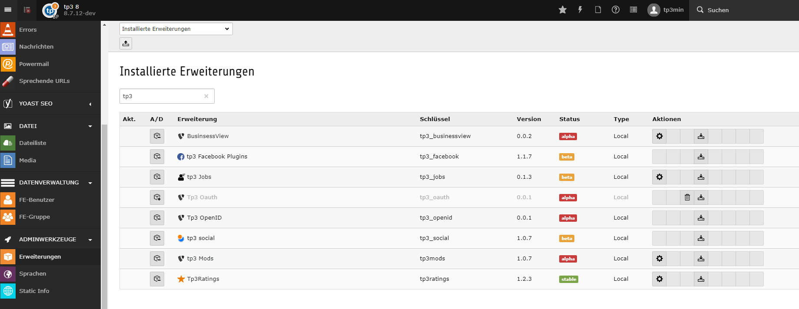

.. ==================================================
.. FOR YOUR INFORMATION
.. --------------------------------------------------
.. -*- coding: utf-8 -*- with BOM.

.. include:: ../Includes.txt

.. _admin-manual:

Administrator Manual
====================

Target group: **Administrators**

.. _admin-installation:

Installation
------------

the extention can be installed from the ter tp3_facebook
https://extensions.typo3.org/extension/tp3_facebook/

To install the extension, perform the following steps:

#. Go to the Extension Manager
#. You can add tp3mods to have the advantage of further microdata
#. afterwards you should include the static template tp3_facebook or add the tssetup manualy

For a list of configuration options, using a definition list is recommended:

Some Configuration
  you can select the diferent plugin types within the contentelement

Other configuration
   megrge into tp3_social to combine alle soc. media
   load on demand - apis are loaded within a click (pagespeed)

   Extension Manager (tp3_facebook)

.. _admin-configuration:

Configuration
-------------

 /Resources/Private/Templates/template.html:
* template for api 2.12 is not yet perfect - but help it to be Contribute at https://github.com/webtp3/tp3_facebook

.. _admin-faq:

FAQ
---

Possible subsection: FAQ

so questions asked yet.

Subsection
^^^^^^^^^^

Some subsection

Sub-subsection
""""""""""""""

Deeper into the structure...
